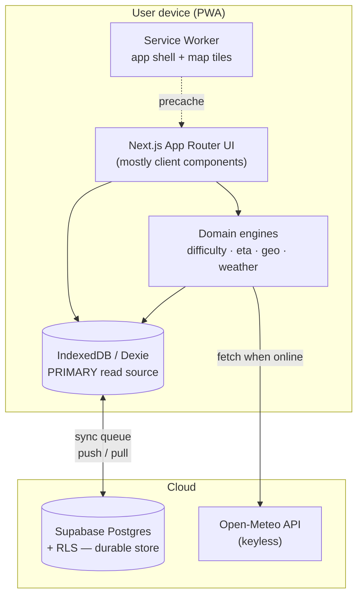
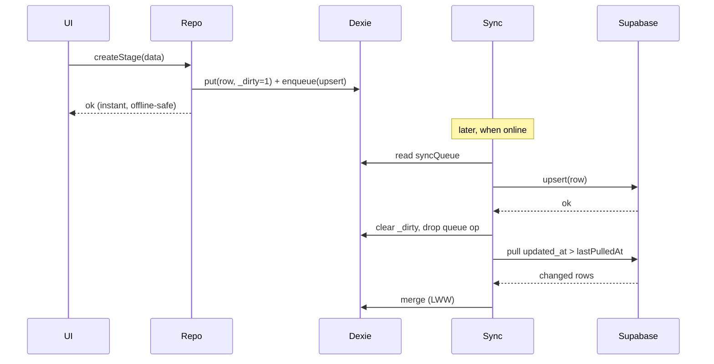

# ARCHITECTURE.md

> **Purpose.** `AGENTS.md` says *how* to build. `PRD.md` says *what* to build.
> This document says *how the system is shaped* — concrete database schema, RLS
> policies, offline storage schema, sync strategy, domain engines, and the
> Next.js directory layout. It is the source of truth for structural decisions.
> When this document and an ad-hoc implementation choice disagree, this document
> wins. If this document is wrong, fix it in a PR before fixing the code.

Status: MVP baseline · Version 1.0

---

## 1. Architectural principles

1. **Local-first, not offline-as-an-afterthought.** The on-device database
   (IndexedDB via Dexie) is the *primary* read source for the app UI. Supabase
   is the durable backup and the sync hub between a user's devices. The UI never
   blocks on the network.
2. **Deterministic domain logic.** Difficulty and ETA are pure, testable
   functions with no I/O and no AI. Same input → same output, always.
3. **Boring, explainable, composable.** YAGNI. No microservices, no premature
   PostGIS, no state-management framework beyond what React + Dexie give us.
4. **The itinerary is the product; the map is a supporting view.** Map code is
   heavy and must be code-split so it never costs the rest of the app.

---

## 2. High-level architecture



Data flow rules:

- **Reads:** UI → Dexie. Never read Supabase directly to render a screen.
- **Writes:** UI → Dexie (mark dirty) → background sync → Supabase.
- **Weather:** fetched from Open-Meteo when online, written to Dexie + Supabase
  `weather_cache`, read offline from Dexie.

---

## 3. Decisions that resolve gaps between AGENTS.md and PRD.md

These are intentional resolutions of inconsistencies found in the source docs.
Each is binding for the MVP.

| # | Conflict in source docs | Decision |
|---|---|---|
| D1 | AGENTS.md separates **Trail** (the objective route, e.g. PCT) from **Itinerary** (user's plan: start date, pace, prefs). PRD.md merges them into one `trails` table. | **Merge for MVP.** One `trails` table = "a user's hike plan". It carries `start_date`, `default_pace_kmh`, `preferences`. Splitting into shared trail templates + per-user itineraries is a **V3** concern (itinerary templates) and must not be built now. |
| D2 | GPX import and the map and the ETA engine all need the **route geometry**, but no table or field stores it. | Add a **`routes`** table holding the GeoJSON `LineString` + derived stats. Stages map onto the route via `start_distance_km` / `end_distance_km`. |
| D3 | PRD `trails` has no **pace** field, but the ETA engine needs it. | `trails.default_pace_kmh` added (overridable per stage later). |
| D4 | PRD defines a `users` table, but Supabase already owns `auth.users`. | Use a **`profiles`** table keyed by `auth.users.id`. Never create a parallel users table. |
| D5 | `weather_cache` as one `forecast_json` blob per trail is too coarse to answer *"where will I be when the rain starts?"* | Redesign as **per-stage, per-sample-point** forecasts (see §6). |
| D6 | AGENTS difficulty inputs list `altitude` + `weather`; PRD lists only `distance/ascent/descent`. | MVP uses **distance/ascent/descent only** (PRD wins). The engine exposes optional altitude/weather modifiers, disabled by default. |
| D7 | Offline-first vs. magic-link auth (auth needs network). | Auth (sign-in) requires network **once**. After that the Supabase session is persisted and the app is fully usable offline; sync resumes when online. |
| D8 | Offline map tiles undefined — the single biggest technical risk. | Recommend **PMTiles** per-trail region download (see §7.3). Do **not** scrape raw OSM tiles (violates the OSM tile usage policy and is fragile offline). |
| D9 | Multi-device sync / conflict resolution undefined. | **Last-write-wins by `updated_at`**, justified because every row is owned by exactly one user. Soft deletes via `deleted_at` tombstones. Client-generated **UUIDv7** IDs so offline creation never collides. |

---

## 4. Directory structure (Next.js App Router)

```
waypoint/
├─ app/
│  ├─ (auth)/
│  │  └─ login/page.tsx              # online-only; magic link + email
│  ├─ (app)/
│  │  ├─ page.tsx                    # Home — trail list (Priority: navigation)
│  │  ├─ trails/[trailId]/
│  │  │  ├─ page.tsx                 # Trail overview + today's stage
│  │  │  ├─ stages/[stageId]/page.tsx# Daily Stage screen (PRIMARY screen)
│  │  │  └─ map/page.tsx             # Map (dynamic import only)
│  │  └─ settings/page.tsx
│  ├─ layout.tsx                     # app shell, registers SW
│  ├─ manifest.ts                    # PWA manifest (route-generated)
│  └─ api/
│     └─ weather/route.ts            # optional thin proxy (see §6)
├─ components/
│  ├─ ui/                            # shadcn/ui primitives
│  ├─ stage/                         # StageHeader, StageStats, StageTimeline
│  ├─ weather/                       # WeatherSummary, WeatherAlertBadge
│  ├─ difficulty/                    # DifficultyBadge, DifficultyBar
│  └─ map/                           # MapView (client-only, lazy)
├─ lib/
│  ├─ domain/
│  │  ├─ difficulty.ts               # pure, deterministic, tested
│  │  ├─ eta.ts                      # Naismith now, Tobler interface ready
│  │  ├─ geo.ts                      # LineString interpolation, haversine
│  │  └─ weather.ts                  # "rain-start position" logic
│  ├─ db/
│  │  ├─ dexie.ts                    # IndexedDB schema
│  │  ├─ sync.ts                     # push/pull engine
│  │  └─ repositories/               # trailRepo, stageRepo, ... (Dexie-backed)
│  ├─ supabase/
│  │  ├─ client.ts                   # browser client (anon key)
│  │  ├─ server.ts                   # server client (SSR shell / login)
│  │  └─ types.ts                    # generated DB types
│  ├─ validation/schemas.ts          # Zod schemas (shared client + server)
│  └─ gpx/parse.ts                   # GPX → LineString + stats
├─ public/
│  ├─ icons/                         # PWA icons (SVG/PNG)
│  └─ basemap/                       # optional bundled PMTiles style
└─ supabase/
   └─ migrations/                    # SQL migrations (this doc's §5 + §6)
```

**Rendering rule:** the `(auth)` segment and the app *shell* may use SSR (good
first paint when online). All data-bearing screens under `(app)` are **client
components reading from Dexie**, because they must work with no network. SSR
must never be on the critical path for opening a cached itinerary.

---

## 5. PostgreSQL schema (Supabase)

> All IDs are **client-generated UUIDv7** strings (time-ordered). The DB does not
> default-generate them, so a device can create rows offline and sync later.
> Every table carries `updated_at` (LWW key) and `deleted_at` (tombstone).
> Every child table denormalizes `user_id` — this keeps RLS a single index
> lookup instead of a join (a known Supabase performance pattern).

```sql
-- supabase/migrations/0001_init.sql
create extension if not exists pgcrypto;

-- updated_at trigger ------------------------------------------------------
create or replace function public.set_updated_at()
returns trigger language plpgsql as $$
begin
  new.updated_at = now();
  return new;
end;
$$;

-- profiles (mirrors auth.users) ------------------------------------------
create table public.profiles (
  id          uuid primary key references auth.users(id) on delete cascade,
  email       text not null,
  display_name text,
  units       text not null default 'metric' check (units in ('metric','imperial')),
  created_at  timestamptz not null default now(),
  updated_at  timestamptz not null default now()
);

-- trails (= a user's hike plan; see D1) ----------------------------------
create table public.trails (
  id               uuid primary key,
  user_id          uuid not null references auth.users(id) on delete cascade,
  name             text not null,
  description      text,
  start_date       date,
  default_pace_kmh numeric(4,2) not null default 4.0,
  preferences      jsonb not null default '{}'::jsonb,
  created_at       timestamptz not null default now(),
  updated_at       timestamptz not null default now(),
  deleted_at       timestamptz
);

-- routes (geometry; see D2) ----------------------------------------------
create table public.routes (
  id                uuid primary key,
  trail_id          uuid not null references public.trails(id) on delete cascade,
  user_id           uuid not null references auth.users(id) on delete cascade,
  geojson           jsonb not null,            -- GeoJSON LineString [lon,lat,ele?]
  total_distance_km numeric(8,2) not null,
  total_ascent_m    integer not null,
  total_descent_m   integer not null,
  elevation_profile jsonb not null default '[]'::jsonb, -- [{d_km, ele_m}] downsampled
  source            text not null default 'gpx' check (source in ('gpx','manual')),
  created_at        timestamptz not null default now(),
  updated_at        timestamptz not null default now(),
  deleted_at        timestamptz
);

-- stages -----------------------------------------------------------------
create table public.stages (
  id                uuid primary key,
  trail_id          uuid not null references public.trails(id) on delete cascade,
  user_id           uuid not null references auth.users(id) on delete cascade,
  title             text not null,
  order_index       integer not null,
  distance_km       numeric(6,2) not null,
  ascent_m          integer not null default 0,
  descent_m         integer not null default 0,
  start_distance_km numeric(8,2),  -- offset along route.geojson (see D2)
  end_distance_km   numeric(8,2),
  difficulty_score  smallint check (difficulty_score between 0 and 100),
  difficulty_class  text check (difficulty_class in ('easy','moderate','hard','extreme')),
  notes             text,
  created_at        timestamptz not null default now(),
  updated_at        timestamptz not null default now(),
  deleted_at        timestamptz
);

-- waypoints --------------------------------------------------------------
create table public.waypoints (
  id                      uuid primary key,
  trail_id                uuid not null references public.trails(id) on delete cascade,
  user_id                 uuid not null references auth.users(id) on delete cascade,
  name                    text not null,
  type                    text not null check (type in
                            ('water','camp','shelter','resupply','town','peak','other')),
  latitude                double precision not null,
  longitude               double precision not null,
  elevation_m             integer,
  distance_along_route_km numeric(8,2),
  description             text,
  created_at              timestamptz not null default now(),
  updated_at              timestamptz not null default now(),
  deleted_at              timestamptz
);

-- weather_cache (per stage + sample point; see D5) -----------------------
create table public.weather_cache (
  id           uuid primary key,
  trail_id     uuid not null references public.trails(id) on delete cascade,
  stage_id     uuid references public.stages(id) on delete cascade,
  user_id      uuid not null references auth.users(id) on delete cascade,
  latitude     double precision not null,
  longitude    double precision not null,
  forecast_json jsonb not null,            -- Open-Meteo hourly + daily payload
  valid_from   timestamptz,
  valid_to     timestamptz,
  fetched_at   timestamptz not null default now(),
  created_at   timestamptz not null default now(),
  updated_at   timestamptz not null default now(),
  deleted_at   timestamptz
);

-- indexes ----------------------------------------------------------------
create index on public.trails        (user_id, updated_at);
create index on public.routes        (trail_id);
create index on public.stages        (trail_id, order_index);
create index on public.waypoints     (trail_id, type);
create index on public.weather_cache (stage_id, fetched_at);

-- updated_at triggers ----------------------------------------------------
create trigger t_profiles      before update on public.profiles      for each row execute function public.set_updated_at();
create trigger t_trails        before update on public.trails        for each row execute function public.set_updated_at();
create trigger t_routes        before update on public.routes        for each row execute function public.set_updated_at();
create trigger t_stages        before update on public.stages        for each row execute function public.set_updated_at();
create trigger t_waypoints     before update on public.waypoints     for each row execute function public.set_updated_at();
create trigger t_weather_cache before update on public.weather_cache for each row execute function public.set_updated_at();
```

### 5.1 Row Level Security

Enable RLS on every table; each row is owner-only. Thanks to the denormalized
`user_id`, every policy is a single `auth.uid() = user_id` check.

```sql
-- supabase/migrations/0002_rls.sql
alter table public.profiles      enable row level security;
alter table public.trails        enable row level security;
alter table public.routes        enable row level security;
alter table public.stages        enable row level security;
alter table public.waypoints     enable row level security;
alter table public.weather_cache enable row level security;

create policy "own profile" on public.profiles
  for all using (auth.uid() = id) with check (auth.uid() = id);

create policy "own trails" on public.trails
  for all using (auth.uid() = user_id) with check (auth.uid() = user_id);

create policy "own routes" on public.routes
  for all using (auth.uid() = user_id) with check (auth.uid() = user_id);

create policy "own stages" on public.stages
  for all using (auth.uid() = user_id) with check (auth.uid() = user_id);

create policy "own waypoints" on public.waypoints
  for all using (auth.uid() = user_id) with check (auth.uid() = user_id);

create policy "own weather" on public.weather_cache
  for all using (auth.uid() = user_id) with check (auth.uid() = user_id);
```

> **Integrity note:** because `user_id` is denormalized, the app layer must set
> it correctly on insert. The `with check` clause guarantees a client can only
> write rows it owns even if it lies.

---

## 6. Weather subsystem

**Provider:** Open-Meteo (keyless, CORS-enabled). The client can call it
directly, saving a backend hop. Use `app/api/weather/route.ts` only if you later
need server-side rate limiting or caching; it is optional for MVP.

**Sampling.** For each stage, sample N representative points along the route
slice (`start_distance_km` → `end_distance_km`): start, midpoint(s), end — e.g.
one point every ~10 km. Fetch the hourly forecast for each.

**"Where will I be when the rain starts?"** (`lib/domain/weather.ts`):

1. Compute the hiker's position for each hour of the stage using the ETA engine
   (`positionAt(time)` → point on the LineString).
2. Look up the forecast for the nearest sampled point.
3. Find the first hour where `precipitation > threshold` (or a warning is
   active).
4. Return that time, the interpolated position, and the nearest waypoint for
   human context ("≈14:40, near the ridge before Lake X").

**Caching / staleness.** Persist forecasts in Dexie + `weather_cache`. Refetch
when online and `fetched_at` is older than 6 h. Offline, always serve the cached
snapshot and surface its age in the UI.

**Alerts (MVP):** display active warnings only (visibility, no logic). Map them
to a single `WeatherAlertBadge`.

---

## 7. Offline & PWA strategy

### 7.1 Service worker

Use Workbox (via `next-pwa` or a hand-written SW). Strategies:

- **App shell / static assets:** precache + `StaleWhileRevalidate`.
- **Supabase API:** do **not** rely on SW caching for data — data lives in
  Dexie. The SW only needs to keep the shell loadable offline.
- **Open-Meteo:** `NetworkFirst` with a short cache; the durable copy is Dexie.

### 7.2 Auth offline (D7)

Supabase persists the session in storage. On boot: if a valid session exists,
go straight to the (local) data. If offline and no session, show a friendly
"sign in once while online" screen. Sign-in (magic link / email) is the only
hard online dependency.

### 7.3 Offline map tiles (D8 — highest-risk item)

Recommended: **PMTiles**. Per trail, let the user "Download offline map" for the
route's bounding box at a sensible zoom range. Store the `.pmtiles` file in
**OPFS** (Origin Private File System) or IndexedDB, and point MapLibre at it via
the PMTiles protocol. Benefits: a single file, no per-tile fetch storm, fully
offline, policy-clean.

Do **not** crawl `tile.openstreetmap.org` — it violates the usage policy and
breaks offline anyway. If PMTiles proves too heavy for MVP, the fallback is a
single bundled low-zoom basemap for context plus the route polyline rendered
from `routes.geojson` (which is always available offline).

---

## 8. On-device storage (Dexie / IndexedDB)

```typescript
// lib/db/dexie.ts
import Dexie, { type Table } from 'dexie';

type Sync = { updated_at: string; deleted_at: string | null; _dirty: 0 | 1 };

export interface TrailRow extends Sync {
  id: string; user_id: string; name: string; description: string | null;
  start_date: string | null; default_pace_kmh: number; preferences: Record<string, unknown>;
}
export interface RouteRow extends Sync {
  id: string; trail_id: string; user_id: string; geojson: GeoJSON.LineString;
  total_distance_km: number; total_ascent_m: number; total_descent_m: number;
  elevation_profile: { d_km: number; ele_m: number }[]; source: 'gpx' | 'manual';
}
export interface StageRow extends Sync {
  id: string; trail_id: string; user_id: string; title: string; order_index: number;
  distance_km: number; ascent_m: number; descent_m: number;
  start_distance_km: number | null; end_distance_km: number | null;
  difficulty_score: number | null; difficulty_class: string | null; notes: string | null;
}
export interface WaypointRow extends Sync {
  id: string; trail_id: string; user_id: string; name: string; type: string;
  latitude: number; longitude: number; elevation_m: number | null;
  distance_along_route_km: number | null; description: string | null;
}
export interface WeatherRow extends Sync {
  id: string; trail_id: string; stage_id: string | null; user_id: string;
  latitude: number; longitude: number; forecast_json: unknown;
  valid_from: string | null; valid_to: string | null; fetched_at: string;
}
export interface SyncOp {
  seq?: number; entity: string; op: 'upsert' | 'delete'; row_id: string; created_at: string;
}

class WaypointDB extends Dexie {
  trails!: Table<TrailRow, string>;
  routes!: Table<RouteRow, string>;
  stages!: Table<StageRow, string>;
  waypoints!: Table<WaypointRow, string>;
  weather!: Table<WeatherRow, string>;
  syncQueue!: Table<SyncOp, number>;

  constructor() {
    super('waypoint');
    this.version(1).stores({
      trails:    'id, user_id, updated_at, _dirty',
      routes:    'id, trail_id, _dirty',
      stages:    'id, trail_id, order_index, _dirty',
      waypoints: 'id, trail_id, type, _dirty',
      weather:   'id, trail_id, stage_id, fetched_at',
      syncQueue: '++seq, entity, created_at',
    });
  }
}

export const db = new WaypointDB();
```

The **repositories** layer (`lib/db/repositories/*`) is the only code the UI
talks to. A repo write updates Dexie, sets `_dirty = 1`, and enqueues a `SyncOp`.

---

## 9. Sync engine (`lib/db/sync.ts`)

Single-user-per-row ownership makes this simple. No CRDTs needed.

**Push** (online): drain `syncQueue` → `supabase.upsert(row)` (or set
`deleted_at` for deletes). On success, clear `_dirty` and remove the queue op.

**Pull** (online): `select * where user_id = me and updated_at > lastPulledAt`.
For each remote row, **last-write-wins by `updated_at`** vs. the local copy.
Apply tombstones (`deleted_at`) by hiding/removing locally. Persist the new
`lastPulledAt`.

**Triggers:** on app focus, on `navigator.onLine` regaining connectivity, and a
light interval while foregrounded. All sync is best-effort and never blocks the
UI.

**IDs:** generate UUIDv7 on the client at creation time so offline-created rows
have stable, time-ordered IDs that sync without renumbering.



---

## 10. Domain engines

All engines are **pure functions** in `lib/domain`, with no I/O, fully unit-
tested. Recompute difficulty and ETA whenever inputs change; cache results onto
the stage row.

### 10.1 Difficulty (`difficulty.ts`)

Deterministic, explainable, tunable. MVP uses distance/ascent/descent only (D6).

```typescript
export interface DifficultyInput { distanceKm: number; ascentM: number; descentM: number; }
export type DifficultyClass = 'easy' | 'moderate' | 'hard' | 'extreme';

// 100 m of climb ≈ 0.85 effort-km; descent adds lighter fatigue (0.25).
const ASCENT_W = 0.85, DESCENT_W = 0.25, EXTREME_EFFORT_KM = 45;

export function scoreDifficulty(i: DifficultyInput): {
  score: number; klass: DifficultyClass; effortKm: number;
} {
  const effortKm =
    i.distanceKm + (i.ascentM / 100) * ASCENT_W + (i.descentM / 100) * DESCENT_W;
  const score = Math.max(0, Math.min(100, Math.round((effortKm / EXTREME_EFFORT_KM) * 100)));
  const klass: DifficultyClass =
    score <= 25 ? 'easy' : score <= 50 ? 'moderate' : score <= 75 ? 'hard' : 'extreme';
  return { score, klass, effortKm };
}
```

The constants are the *only* tunable knobs and live in one place so the score
stays explainable. Optional altitude/weather modifiers are documented hooks,
disabled by default per PRD.

### 10.2 ETA (`eta.ts`)

Naismith now; Tobler is a drop-in alternative behind the same interface.

```typescript
// Naismith: time = distance / pace + ascent / climbRate
const CLIMB_RATE_M_PER_H = 600;

export function naismithHours(distanceKm: number, ascentM: number, paceKmh: number): number {
  return distanceKm / paceKmh + ascentM / CLIMB_RATE_M_PER_H;
}

// Tobler walking speed (km/h) for a given slope (dh/dx); integrate over segments.
export function toblerSpeedKmh(slope: number): number {
  return 6 * Math.exp(-3.5 * Math.abs(slope + 0.05));
}
```

`positionAt(startTime, now, route)` uses `naismithHours` to convert elapsed time
→ cumulative distance, then `geo.pointAtDistance(route.geojson, km)` to get the
lat/lon. This is what powers "where will I be at 15:00?" and the weather logic.

### 10.3 Geometry (`geo.ts`)

Haversine distance, cumulative distance along a `LineString`, and
`pointAtDistance` (linear interpolation between vertices). Keep it hand-rolled or
import only the specific turf functions needed — **do not** pull in all of turf
(bundle budget, §11).

---

## 11. Performance budget

Lighthouse targets (from AGENTS/PRD): Performance > 90, A11y > 95, Best
Practices > 95. Initial load < 2 s on 4G; offline open < 1 s.

- **Code-split the map.** `MapView` is loaded with `dynamic(() => ..., { ssr:false })`
  and only on the `/map` route. MapLibre must never be in the main bundle.
- **No moment.js / no full turf / no lodash.** Use the Temporal-style date utils
  or `date-fns` (tree-shaken).
- **Icons as inline SVG.** No icon font.
- **Offline open path** reads Dexie only — no awaiting the network, no SSR.
- Treat any third-party dep over ~30 KB gz as a decision requiring this doc to be
  updated.

---

## 12. Validation, config, testing

- **Validation:** Zod schemas in `lib/validation/schemas.ts`, shared by forms,
  repositories, and GPX parsing. GPX-derived data is validated before it ever
  reaches Dexie.
- **Config:** `NEXT_PUBLIC_SUPABASE_URL`, `NEXT_PUBLIC_SUPABASE_ANON_KEY` only on
  the client. The service-role key must never reach the browser.
- **Testing:** domain engines get exhaustive unit tests (pure → trivial to test).
  Sync logic is tested against `fake-indexeddb`. RLS is verified with a Supabase
  test that asserts a user cannot read another user's rows.

---

## 13. Open decisions (revisit, don't pre-build)

- **PMTiles vs. bundled basemap** for offline maps — start with PMTiles; fall
  back to route-polyline-only if it bloats the MVP.
- **PostGIS** — not now. Geometry math is client-side on the GeoJSON. Adopt only
  if server-side spatial queries become necessary (V2+ water-source discovery).
- **Trail templates / sharing** (AGENTS' Trail/Itinerary split) — V3. Revisit D1
  when itinerary templates land.
- **Server actions** — minimal in a local-first app. Use them for the SSR shell
  and login flow; data mutations go through Dexie + sync, not server actions.

---

*This file pairs with `AGENTS.md` (how to build) and `PRD.md` (what to build).
Keep all three in the repo root.*
