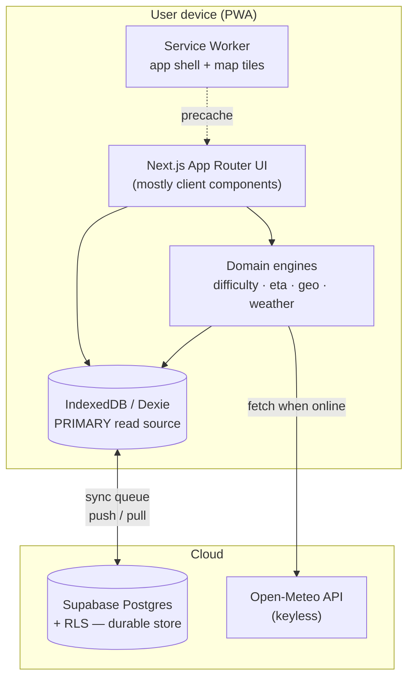
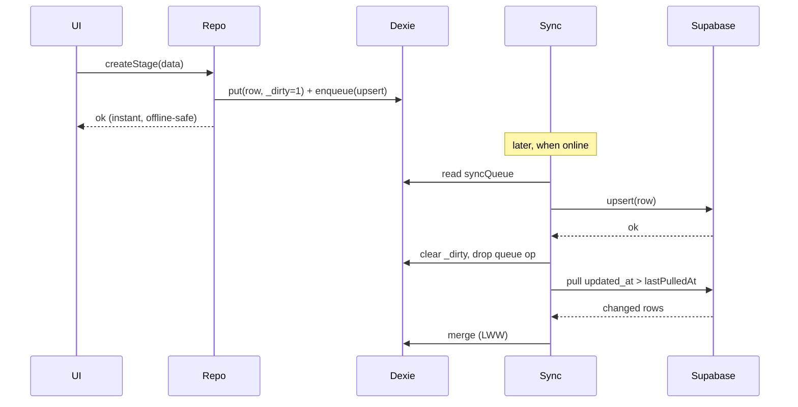

# ARCHITECTURE.md

> **Purpose.** `AGENTS.md` says *how* to build. `PRD.md` says *what* to build.
> This document says *how the system is shaped* — concrete database schema, RLS
> policies, offline storage schema, sync strategy, domain engines, and the
> Next.js directory layout. It is the source of truth for structural decisions.
> When this document and an ad-hoc implementation choice disagree, this document
> wins. If this document is wrong, fix it in a PR before fixing the code.

Status: MVP baseline · Version 1.0

---

## 1. Architectural principles

1. **Local-first, not offline-as-an-afterthought.** The on-device database
   (IndexedDB via Dexie) is the *primary* read source for the app UI. Supabase
   is the durable backup and the sync hub between a user's devices. The UI never
   blocks on the network.
2. **Deterministic domain logic.** Difficulty and ETA are pure, testable
   functions with no I/O and no AI. Same input → same output, always.
3. **Boring, explainable, composable.** YAGNI. No microservices, no premature
   PostGIS, no state-management framework beyond what React + Dexie give us.
4. **The itinerary is the product; the map is a supporting view.** Map code is
   heavy and must be code-split so it never costs the rest of the app.

---

## 2. High-level architecture



Data flow rules:

- **Reads:** UI → Dexie. Never read Supabase directly to render a screen.
- **Writes:** UI → Dexie (mark dirty) → background sync → Supabase.
- **Weather:** fetched from Open-Meteo when online, written to Dexie + Supabase
  `weather_cache`, read offline from Dexie.

---

## 3. Decisions that resolve gaps between AGENTS.md and PRD.md

These are intentional resolutions of inconsistencies found in the source docs.
Each is binding for the MVP.

| # | Conflict in source docs | Decision |
|---|---|---|
| D1 | AGENTS.md separates **Trail** (the objective route, e.g. PCT) from **Itinerary** (user's plan: start date, pace, prefs). PRD.md merges them into one `trails` table. | **Merge for MVP.** One `trails` table = "a user's hike plan". It carries `start_date`, `default_pace_kmh`, `preferences`. Splitting into shared trail templates + per-user itineraries is a **V3** concern (itinerary templates) and must not be built now. |
| D2 | GPX import and the map and the ETA engine all need the **route geometry**, but no table or field stores it. | Add a **`routes`** table holding the GeoJSON `LineString` + derived stats. Originally stages mapped onto a single trail-level route via `start_distance_km` / `end_distance_km`. **Updated MVP decision:** each stage now owns its own route (`routes.stage_id`). One `<trk>` in the GPX = one stage = one route. This eliminates error-prone distance slicing and makes per-stage weather sampling, ETA, and the elevation profile self-contained. See §5.2 (GPX import) and migration `0004_route_per_stage`. |
| D3 | PRD `trails` has no **pace** field, but the ETA engine needs it. | `trails.default_pace_kmh` added (overridable per stage later). |
| D4 | PRD defines a `users` table, but Supabase already owns `auth.users`. | Use a **`profiles`** table keyed by `auth.users.id`. Never create a parallel users table. |
| D5 | `weather_cache` as one `forecast_json` blob per trail is too coarse to answer *"where will I be when the rain starts?"* | Redesign as **per-stage, per-sample-point** forecasts (see §6). |
| D6 | AGENTS difficulty inputs list `altitude` + `weather`; PRD lists only `distance/ascent/descent`. | MVP uses **distance/ascent/descent only** (PRD wins). The engine exposes optional altitude/weather modifiers, disabled by default. |
| D7 | Offline-first vs. email OTP auth (auth needs network). | Auth (sign-in) requires network **once** to receive and verify the one-time email code. After that the Supabase session is persisted and the app is fully usable offline; sync resumes when online. |
| D8 | Offline map tiles undefined — the single biggest technical risk. | Recommend **PMTiles** per-trail region download (see §7.3). Do **not** scrape raw OSM tiles (violates the OSM tile usage policy and is fragile offline). |
| D9 | Multi-device sync / conflict resolution undefined. | **Last-write-wins by `updated_at`**, justified because every row is owned by exactly one user. Soft deletes via `deleted_at` tombstones. Client-generated **UUIDv7** IDs so offline creation never collides. |
| D10 | Not every day of a thru-hike is a hiking day (travel to/from the trailhead, rest days). | Add a **`stage_type`** discriminator (`'trek'` \| `'transit'`). A *trek* day has distance/ascent/route/weather; a *transit* day instead carries an editable **`timeline`** (jsonb array of milestones — bus/train/flight/transfer/checkin/meal/note) and an optional **`location_lat/lon/name`** anchor for weather (it has no route midpoint). One `stages` table, not a second entity. See `0005`. |
| D11 | A stage's calendar date is derived from `trail.start_date + order_index`, but rest days / schedule drift break that 1:1 mapping. | Add a nullable per-stage **`date`** override. NULL = derive as before; an explicit value pins that one day without disturbing neighbours. Derivation lives in `web/lib/domain/stageDate.ts` (UTC-safe). See `0006`. |
| D12 | Hikers carry a mental checklist (resupply, book a hut, charge battery) that belongs to a day, not a route. | Add a synced **`todos`** table — lightweight reminders optionally pinned to a stage and/or date, surfaced on the Today dashboard. Same offline-first ownership/sync shape as other entities. See `0007`. |
| D13 | The Home hero and trail cards look bare without imagery. | Trails carry an optional **`cover_image_url`**; images are resized + re-encoded to **WebP client-side** and uploaded to a public Supabase Storage bucket (`trail-covers`) scoped to the owner's folder by RLS. See `0008`, `0009`, `0011`. |
| D14 | The public welcome screen needs curated photography that non-developers can manage. | Admin-managed **`welcome_photos`** + an **`admin_users`** table and `is_admin()` helper; public read of active photos, admin-only writes, backed by a `welcome-photos` storage bucket. See `0010`. |
| D15 | Public storage buckets accepted any file type — an authenticated user could upload an SVG/HTML payload and serve it as a public URL on our domain. | Restrict both buckets to `{image/webp, image/jpeg, image/png}` and cap uploads at 10 MB **at the bucket level** (Storage API enforces it regardless of client). `SECURITY DEFINER` functions (`handle_new_user`, `set_updated_at`, `is_admin`) had EXECUTE granted to `anon` via `/rest/v1/rpc/*`; revoked. Child-table RLS `WITH CHECK` now also validates that `trail_id` belongs to the caller. HTTP security headers (CSP, HSTS, X-Frame-Options, …) added in `next.config.ts`. See `0012`, `0013`. |

---

## 4. Directory structure (Next.js App Router)

```
waypoint/
├─ app/
│  ├─ (auth)/
│  │  └─ login/                      # online-only; email OTP code
│  │     ├─ page.tsx
│  │     ├─ OtpLoginForm.tsx
│  │     └─ actions.ts
│  ├─ (app)/                         # authenticated shell (TabBar + sync)
│  │  ├─ page.tsx                    # Home — trail list + active-trek hero
│  │  ├─ today/page.tsx             # Daily dashboard (active trek, moving forecast, todos)
│  │  ├─ weather/page.tsx           # Current-position weather + meteogram + radar
│  │  ├─ trails/
│  │  │  ├─ new/page.tsx            # Manual new-trail form
│  │  │  └─ [trailId]/
│  │  │     ├─ page.tsx             # Trail overview + stage list
│  │  │     ├─ stages/[stageId]/page.tsx  # Daily Stage screen (PRIMARY screen)
│  │  │     └─ map/page.tsx         # Map (dynamic import only)
│  │  ├─ account/                   # Profile + sign-out (page.tsx + actions.ts)
│  │  ├─ settings/page.tsx
│  │  ├─ admin/welcome-photos/page.tsx   # Admin: manage welcome-screen photos
│  │  └─ layout.tsx                 # app shell: TabBar, SyncProvider, SW register
│  ├─ welcome/page.tsx              # Public marketing/welcome screen (guests)
│  ├─ onboarding/page.tsx           # First-run onboarding (post sign-in)
│  ├─ layout.tsx                    # root layout, fonts, metadata
│  ├─ globals.css                   # design tokens (oklch palette, difficulty colors)
│  ├─ auth/confirm/route.ts         # OTP/magic-link confirm handler
│  └─ api/
│     └─ alerts/route.ts            # MeteoAlarm server proxy (see §7.4)
├─ components/
│  ├─ ui/                            # primitives.tsx, alert-dialog.tsx
│  ├─ brand/                         # Waypoint logo mark
│  ├─ nav/                           # TabBar (glass pill bottom nav)
│  ├─ dashboard/                     # ActiveTrekHero, MovingForecast, TodoList
│  ├─ stage/                         # StageHeader, StageStats, StageTimeline, TransitEditForm, WeatherCard
│  ├─ weather/                       # Meteogram, RadarMap, WeatherAlertBadge, OfflineBanner, WeatherEmptyState
│  ├─ difficulty/                    # DifficultyBadge
│  ├─ route/                         # GpxImportZone, ElevationChart
│  ├─ map/                           # MapView (client-only, lazy) + colors
│  ├─ sync/                          # SyncProvider, SyncedChip
│  ├─ welcome/                       # WelcomeHero
│  ├─ admin/                         # WelcomePhotoManager
│  └─ pwa/                           # RegisterSW
├─ lib/
│  ├─ domain/
│  │  ├─ difficulty.ts               # pure, deterministic, tested
│  │  ├─ eta.ts                      # Naismith now, Tobler interface ready
│  │  ├─ geo.ts                      # LineString interpolation, haversine, bbox
│  │  ├─ stageDate.ts                # derive/override per-stage calendar date (UTC-safe)
│  │  ├─ activeTrail.ts              # pick the trail whose schedule covers today
│  │  ├─ daySummary.ts               # deterministic one-line day briefing (no AI)
│  │  └─ greeting.ts                 # time-of-day greeting
│  ├─ weather/
│  │  ├─ openmeteo.ts                # keyless single-day hourly fetch
│  │  ├─ forecast.ts                 # route snapshot (start/moving/end phases)
│  │  ├─ current-position.ts         # /weather page fetch + ephemeral cache
│  │  ├─ geocoding.ts                # Open-Meteo place search
│  │  ├─ rainviewer.ts               # radar frames + tiles (past only)
│  │  ├─ offline-fallback.ts         # cached snapshot for offline /weather
│  │  ├─ visibleSlots.ts             # trim moving forecast to hours still ahead
│  │  └─ types.ts                    # OpenMeteoForecast, MeteogramData, GpsPosition
│  ├─ alerts/meteoalarm.ts           # MeteoAlarm CAP normaliser (see §7.4)
│  ├─ db/
│  │  ├─ dexie.ts                    # IndexedDB schema (v8)
│  │  ├─ sync.ts                     # push/pull engine + status observable
│  │  └─ repositories/               # trail, stage, route, waypoint, weather, alerts, todo
│  ├─ supabase/
│  │  ├─ client.ts                   # browser client (anon key)
│  │  ├─ server.ts                   # server client (SSR shell / login)
│  │  └─ types.ts                    # generated DB types
│  ├─ storage/                       # covers.ts, welcomePhotos.ts (image upload + WebP)
│  ├─ welcome/photos.ts              # read active welcome photo
│  ├─ auth/                          # post-auth.ts (profile+onboarding), session.ts
│  ├─ hooks/useSyncStatus.ts         # sync chip state
│  ├─ format/hours.ts                # human time formatting
│  ├─ validation/schemas.ts          # Zod schemas (shared client + server)
│  └─ gpx/
│     ├─ parse.ts                    # parseGPXTracks() + parseGPX() — multi-track aware
│     └─ import.ts                   # importTrek() — trail + stages + routes in one shot
├─ proxy.ts                          # Next.js 16 auth redirect proxy (session refresh)
├─ public/                           # icons, favicons, brand assets, manifest
└─ supabase/
   └─ migrations/                    # SQL migrations (this doc's §5 + §6)
```

**Rendering rule:** the `(auth)` segment and the app *shell* may use SSR (good
first paint when online). All data-bearing screens under `(app)` are **client
components reading from Dexie**, because they must work with no network. SSR
must never be on the critical path for opening a cached itinerary.

---

## 5. PostgreSQL schema (Supabase)

> All IDs are **client-generated UUIDv7** strings (time-ordered). The DB does not
> default-generate them, so a device can create rows offline and sync later.
> Every table carries `updated_at` (LWW key) and `deleted_at` (tombstone).
> Every child table denormalizes `user_id` — this keeps RLS a single index
> lookup instead of a join (a known Supabase performance pattern).

```sql
-- supabase/migrations/0001_init.sql
create extension if not exists pgcrypto;

-- updated_at trigger ------------------------------------------------------
create or replace function public.set_updated_at()
returns trigger language plpgsql as $$
begin
  new.updated_at = now();
  return new;
end;
$$;

-- profiles (mirrors auth.users) ------------------------------------------
create table public.profiles (
  id          uuid primary key references auth.users(id) on delete cascade,
  email       text not null,
  display_name text,
  units       text not null default 'metric' check (units in ('metric','imperial')),
  created_at  timestamptz not null default now(),
  updated_at  timestamptz not null default now()
);

-- trails (= a user's hike plan; see D1) ----------------------------------
create table public.trails (
  id               uuid primary key,
  user_id          uuid not null references auth.users(id) on delete cascade,
  name             text not null,
  description      text,
  start_date       date,
  default_pace_kmh numeric(4,2) not null default 4.0,
  preferences      jsonb not null default '{}'::jsonb,
  cover_image_url  text,                      -- public Storage URL (D13, 0008)
  created_at       timestamptz not null default now(),
  updated_at       timestamptz not null default now(),
  deleted_at       timestamptz
);

-- routes (geometry; see D2 + §5.2) ----------------------------------------
-- Each stage owns one route (stage_id NOT NULL after import).
-- null stage_id is reserved for a future trail-level merged overview geometry.
create table public.routes (
  id                uuid primary key,
  trail_id          uuid not null references public.trails(id) on delete cascade,
  stage_id          uuid references public.stages(id) on delete cascade, -- per-stage (0004)
  user_id           uuid not null references auth.users(id) on delete cascade,
  geojson           jsonb not null,            -- GeoJSON LineString [lon,lat,ele?]
  total_distance_km numeric(8,2) not null,
  total_ascent_m    integer not null,
  total_descent_m   integer not null,
  elevation_profile jsonb not null default '[]'::jsonb, -- [{d_km, ele_m}] downsampled ≤500 pts
  source            text not null default 'gpx' check (source in ('gpx','manual')),
  created_at        timestamptz not null default now(),
  updated_at        timestamptz not null default now(),
  deleted_at        timestamptz
);

-- stages -----------------------------------------------------------------
-- A stage is one day. stage_type discriminates a hiking day ('trek') from a
-- travel/rest day ('transit'); see D10. A transit day uses timeline +
-- location_* instead of distance/route/weather-midpoint.
create table public.stages (
  id                uuid primary key,
  trail_id          uuid not null references public.trails(id) on delete cascade,
  user_id           uuid not null references auth.users(id) on delete cascade,
  title             text not null,
  order_index       integer not null,
  date              date,                          -- per-stage override (D11, 0006); NULL = derive
  stage_type        text not null default 'trek'   -- D10, 0005
                      check (stage_type in ('trek','transit')),
  distance_km       numeric(6,2) not null,
  ascent_m          integer not null default 0,
  descent_m         integer not null default 0,
  start_distance_km numeric(8,2),  -- deprecated; kept for compat, not used when stage owns its route
  end_distance_km   numeric(8,2),  -- deprecated; same
  difficulty_score  smallint check (difficulty_score between 0 and 100),
  difficulty_class  text check (difficulty_class in ('easy','moderate','hard','extreme')),
  notes             text,
  timeline          jsonb not null default '[]'::jsonb,  -- transit-day milestones (D10, 0005)
  location_lat      numeric(9,6),                  -- transit weather anchor (D10, 0005)
  location_lon      numeric(9,6),
  location_name     text,
  created_at        timestamptz not null default now(),
  updated_at        timestamptz not null default now(),
  deleted_at        timestamptz
);

-- waypoints --------------------------------------------------------------
create table public.waypoints (
  id                      uuid primary key,
  trail_id                uuid not null references public.trails(id) on delete cascade,
  user_id                 uuid not null references auth.users(id) on delete cascade,
  name                    text not null,
  type                    text not null check (type in
                            ('water','camp','shelter','resupply','town','peak','other')),
  latitude                double precision not null,
  longitude               double precision not null,
  elevation_m             integer,
  distance_along_route_km numeric(8,2),
  description             text,
  created_at              timestamptz not null default now(),
  updated_at              timestamptz not null default now(),
  deleted_at              timestamptz
);

-- weather_cache (per stage + sample point; see D5) -----------------------
create table public.weather_cache (
  id           uuid primary key,
  trail_id     uuid not null references public.trails(id) on delete cascade,
  stage_id     uuid references public.stages(id) on delete cascade,
  user_id      uuid not null references auth.users(id) on delete cascade,
  latitude     double precision not null,
  longitude    double precision not null,
  forecast_json jsonb not null,            -- Open-Meteo hourly + daily payload
  valid_from   timestamptz,
  valid_to     timestamptz,
  fetched_at   timestamptz not null default now(),
  created_at   timestamptz not null default now(),
  updated_at   timestamptz not null default now(),
  deleted_at   timestamptz
);

-- todos (per-day reminders for the dashboard; see D12 + 0007) -------------
create table public.todos (
  id          uuid primary key,
  user_id     uuid not null references auth.users(id) on delete cascade,
  trail_id    uuid not null references public.trails(id) on delete cascade,
  stage_id    uuid references public.stages(id) on delete cascade,  -- optional pin
  date        date,                                                 -- optional pin
  text        text not null,
  done        boolean not null default false,
  order_index integer not null default 0,
  created_at  timestamptz not null default now(),
  updated_at  timestamptz not null default now(),
  deleted_at  timestamptz
);

-- welcome screen photos (admin-managed; see D14 + 0010) ------------------
-- admin_users gates writes; is_admin() (security definer) backs the policies.
create table public.admin_users (
  user_id    uuid primary key references auth.users(id) on delete cascade,
  created_at timestamptz not null default now()
);

create table public.welcome_photos (
  id             uuid primary key,
  storage_path   text not null unique,
  public_url     text not null,
  alt_text       text not null,
  location_label text,
  sort_order     integer not null default 0,
  is_active      boolean not null default true,
  created_by     uuid references auth.users(id) on delete set null,
  created_at     timestamptz not null default now(),
  updated_at     timestamptz not null default now(),
  deleted_at     timestamptz
);

-- indexes ----------------------------------------------------------------
create index on public.trails        (user_id, updated_at);
create index on public.routes        (trail_id);
create index on public.routes        (stage_id);    -- added by 0004_route_per_stage
create index on public.stages        (trail_id, order_index);
create index on public.stages        (trail_id, stage_type);  -- added by 0005
create index on public.waypoints     (trail_id, type);
create index on public.weather_cache (stage_id, fetched_at);
create index on public.todos         (trail_id);
create index on public.todos         (stage_id);

-- updated_at triggers ----------------------------------------------------
create trigger t_profiles       before update on public.profiles       for each row execute function public.set_updated_at();
create trigger t_trails         before update on public.trails         for each row execute function public.set_updated_at();
create trigger t_routes         before update on public.routes         for each row execute function public.set_updated_at();
create trigger t_stages         before update on public.stages         for each row execute function public.set_updated_at();
create trigger t_waypoints      before update on public.waypoints      for each row execute function public.set_updated_at();
create trigger t_weather_cache  before update on public.weather_cache  for each row execute function public.set_updated_at();
create trigger t_todos          before update on public.todos          for each row execute function public.set_updated_at();
create trigger t_welcome_photos before update on public.welcome_photos for each row execute function public.set_updated_at();
```

> **Migrations on disk.** `0001_init`, `0002_rls`, `0004_route_per_stage`,
> `0005_stage_type_timeline`, `0006_stage_date`, `0007_todos`,
> `0008_trail_cover_image`, `0009_trail_covers_storage`, `0010_welcome_photos`,
> `0011_fix_trail_cover_storage_policies`, `0012_security_hardening`,
> `0013_rls_parent_ownership`. (`0003` — the original profile-on-signup trigger
> — was re-introduced and hardened in `0012`: `handle_new_user` is a live
> trigger on `auth.users` (`on_auth_user_created`); `postAuthPath` also upserts
> defensively, so both paths work independently.)

### 5.1 GPX import flow

The primary way a user creates a trail is by importing a **multi-day GPX file**
exported from mapy.com (or any GPX tool that uses one `<trk>` per day).

```
GPX file
└─ <trk> "Deň 1 – utorok"   →  stage (order 0)  +  route (stage_id = stage.id)
└─ <trk> "Deň 2 – streda"   →  stage (order 1)  +  route (stage_id = stage.id)
   ...
└─ <trk> "Deň N"            →  stage (order N-1) +  route (stage_id = stage.id)
```

**Parser (`web/lib/gpx/parse.ts` → `parseGPXTracks`)**

- Splits on `<trk>` / `<rte>` boundaries — never stitches across them.
  Stitching caused phantom ~16 km inter-day jumps (mapy.com exports days
  in *reverse* order; the parser un-reverses them).
- **Ordering:** primary = integer extracted from track name (`"Deň 6"` → 6);
  fallback = continuity heuristic (which orientation minimises end→start gaps).
- Per-track stats (distance, ascent, descent, elevation profile) are
  computed independently. `parseGPX()` merges ordered tracks (with boundary
  dedup) for any caller that still needs a single LineString.

**Orchestration (`web/lib/gpx/import.ts` → `importTrek`)**

1. `parseGPXTracks(xml)` → ordered `ParsedTrack[]`
2. `trailRepo.create(...)` — name derived from file name (`deriveTrailName`)
3. For each track: `stageRepo.create(...)` (difficulty computed automatically)
4. `routeRepo.bulkCreate(...)` — one route per stage, Dexie transaction
5. Redirect to new trail

**UI (`web/components/route/GpxImportZone.tsx`)**

- File pick → immediate parse → **preview modal** (N days, total km/↑m,
  per-day list) so the user can confirm before anything is written.
- Trail name (pre-filled from file) + optional start date (required for
  weather forecasts).
- Cancel at any point; nothing is written until "Create trail" is confirmed.
- Lives on the Home screen above the trail list.

### 5.2 Row Level Security

Enable RLS on every table; each row is owner-only. Thanks to the denormalized
`user_id`, every policy is a single `auth.uid() = user_id` check.

```sql
-- supabase/migrations/0002_rls.sql
alter table public.profiles      enable row level security;
alter table public.trails        enable row level security;
alter table public.routes        enable row level security;
alter table public.stages        enable row level security;
alter table public.waypoints     enable row level security;
alter table public.weather_cache enable row level security;

create policy "own profile" on public.profiles
  for all using (auth.uid() = id) with check (auth.uid() = id);

create policy "own trails" on public.trails
  for all using (auth.uid() = user_id) with check (auth.uid() = user_id);

create policy "own routes" on public.routes
  for all using (auth.uid() = user_id) with check (auth.uid() = user_id);

create policy "own stages" on public.stages
  for all using (auth.uid() = user_id) with check (auth.uid() = user_id);

create policy "own waypoints" on public.waypoints
  for all using (auth.uid() = user_id) with check (auth.uid() = user_id);

create policy "own weather" on public.weather_cache
  for all using (auth.uid() = user_id) with check (auth.uid() = user_id);

create policy "own todos" on public.todos
  for all using (auth.uid() = user_id) with check (auth.uid() = user_id);
```

> **Integrity note:** because `user_id` is denormalized, the app layer must set
> it correctly on insert. The `with check` clause guarantees a client can only
> write rows it owns even if it lies.

**Welcome photos (D14)** are the one shared, non-user-owned dataset. Access is
role-based via an `is_admin()` SQL helper (`security definer`, reads
`admin_users`): anon + authenticated may **read active** photos; only admins may
read-all / insert / update / delete. The `admin_users` table is admin-readable
only.

**Storage buckets** (public, RLS on `storage.objects`):
- `trail-covers` — public read; owner-only write, scoped by the first path
  segment `{auth.uid()}/…` (`0009`, tightened in `0011`).
- `welcome-photos` — public read; admin-only write via `is_admin()` (`0010`).

Both buckets are restricted to `allowed_mime_types = {image/webp, image/jpeg,
image/png}` and `file_size_limit = 10 MB` at the bucket level (`0012`).

**Security hardening** (`0012`, `0013`, `next.config.ts`):

| Layer | What was tightened |
|---|---|
| Storage buckets | `allowed_mime_types` + `file_size_limit` — blocks SVG/HTML payloads regardless of client |
| Supabase functions | `EXECUTE` revoked from `anon` on all `SECURITY DEFINER` functions; `authenticated` retains it only on `is_admin()` (required for RLS policies); `search_path` pinned on all three |
| RLS child tables | `WITH CHECK` on `routes/stages/waypoints/weather_cache/todos` also calls `_owns_trail(trail_id)` to block cross-user trail references |
| HTTP headers | CSP (allow-list per real outbound hosts), `X-Frame-Options: DENY`, `X-Content-Type-Options`, `Referrer-Policy`, `Permissions-Policy`, `Strict-Transport-Security` |
| `/api/alerts` | In-memory fixed-window rate limit (60 req/min/IP) |
| GPX import | 25 MB file cap before `file.text()` to prevent main-thread lockup |

`is_admin()` callable by `authenticated` is intentional — it backs the welcome_photos and storage RLS policies. The Supabase advisor flags it but revoking would break the admin section.

---

## 6. Weather subsystem

**Provider:** Open-Meteo (keyless, CORS-enabled). The client can call it
directly, saving a backend hop. Use `web/app/api/weather/route.ts` only if you later
need server-side rate limiting or caching; it is optional for MVP.

**Sampling.** Each stage owns its own route geometry (see §5.1). Sample the
midpoint of that geometry (`route.total_distance_km / 2` → `pointAtDistance`)
for the weather fetch. For longer stages, `samplePoints(line, N)` can provide
additional sample points. Fetch the Open-Meteo hourly forecast for each point.

**"Where will I be when the rain starts?"** (`web/lib/domain/weather.ts`):

1. Compute the hiker's position for each hour of the stage using the ETA engine
   (`positionAt(time)` → point on the LineString).
2. Look up the forecast for the nearest sampled point.
3. Find the first hour where `precipitation > threshold` (or a warning is
   active).
4. Return that time, the interpolated position, and the nearest waypoint for
   human context ("≈14:40, near the ridge before Lake X").

**Caching / staleness.** Persist forecasts in Dexie + `weather_cache`. Refetch
when online and `fetched_at` is older than 6 h. Offline, always serve the cached
snapshot and surface its age in the UI.

**Moving forecast (Today dashboard).** `web/lib/weather/forecast.ts` builds a
three-phase snapshot of the active stage (start / moving / end). At render time
`visibleSlots.ts` trims it to the hours still *ahead* of now (the
`MovingForecast` widget never shows hours that already passed). The deterministic
one-line briefing on the dashboard comes from `web/lib/domain/daySummary.ts` — every
clause is templated from the day's own data (no AI, per PRD Non-Goals).

**Current-position weather (`/weather` page).** A standalone screen, decoupled
from any trail: it geolocates the user (or accepts a place searched via
`web/lib/weather/geocoding.ts`, keyless Open-Meteo geocoding) and renders six
`Meteogram` panels (temperature, cloud cover, precipitation, pressure, wind,
gusts) drawn with **uPlot**. `web/lib/weather/current-position.ts` fetches a richer
hourly payload and caches it in the Dexie `ephemeral_weather` table — a
**local-only, never-synced** read-through cache keyed by coarse (~1 km)
coordinates, 6 h staleness, pruned after 24 h. Offline,
`web/lib/weather/offline-fallback.ts` reconstructs a meteogram from the active
trail's cached stage weather so the page still renders.

**Radar overlay.** `web/components/weather/RadarMap.tsx` overlays RainViewer past
radar frames (`web/lib/weather/rainviewer.ts`) on the map. Free tier (2026): past
~2 h only, max zoom 7, Universal Blue scheme, attribution required, nowcast
discontinued — the client degrades to an empty state on any failure.

**Alerts (MVP):** display active warnings only (visibility, no logic). Map them
to a single `WeatherAlertBadge`. See §7.4.

---

## 7. Offline & PWA strategy

### 7.1 Service worker

Use Workbox (via `next-pwa` or a hand-written SW). Strategies:

- **App shell / static assets:** precache + `StaleWhileRevalidate`.
- **Supabase API:** do **not** rely on SW caching for data — data lives in
  Dexie. The SW only needs to keep the shell loadable offline.
- **Open-Meteo:** `NetworkFirst` with a short cache; the durable copy is Dexie.

### 7.2 Auth offline (D7)

Supabase persists the session in storage. On boot: if a valid session exists,
go straight to the (local) data. If offline and no session, show a friendly
"sign in once while online" screen. Sign-in with an email OTP code is the
only hard online dependency.

### 7.3 Map (F4a — implemented, F4b — deferred)

**F4a (done):** MapLibre GL JS + MapTiler vector tiles.

- `web/components/map/MapView.tsx` — client-only, code-split via
  `dynamic(…, {ssr:false})`. MapLibre never enters the main bundle.
- Basemap: **MapTiler outdoor-v2** (`NEXT_PUBLIC_MAPTILER_API_KEY`).
  If the key is absent → graceful fallback: blank `#e8eae6` canvas with
  the route polyline still drawn (works 100% offline).
- Route polylines drawn from local `routes.geojson` (Dexie — always
  available offline). Colors match difficulty tokens from `globals.css`
  (Hard = `#ea580c`, Moderate = `#d97706`, Easy = `#16a34a`,
  Extreme = `#dc2626`; default blue = `#2563eb`).
- `bboxOf` / `mergeBboxes` in `geo.ts` → `fitBounds` zooms to the
  route automatically.
- `pmtiles` protocol registered at startup so F4b needs only a URL swap.
- Two entry points: full-screen `trails/[trailId]/map/page.tsx` (trail
  overview); compact 224 px section on the Stage page with "Full map"
  link.

**F4b (deferred):** Per-trail offline tile download. User triggers
"Download offline map" → bounding box extracted → Protomaps regional
`.pmtiles` file stored in **OPFS** → `pmtiles://` URL passed to the
same `MapView`. No code changes needed in MapView.

Do **not** crawl `tile.openstreetmap.org` — violates the usage policy.

### 7.4 Weather alerts (F5 — implemented)

MeteoAlarm (EUMETNET) CAP JSON feed. The browser cannot call it directly
(CORS + user-agent blocking), so it goes through a thin server proxy.

**Flow:** Stage page → `GET /api/alerts?lat=…&lon=…` →
`web/app/api/alerts/route.ts` (server) → `slugFromLatLon` maps the stage
midpoint to a country → `feeds.meteoalarm.org/api/v1/warnings/feeds-{country}` →
`parseMeteoalarmFeed` normalises CAP JSON → Dexie `alerts` table
(cache-only, **never synced to Supabase**, 3 h TTL) → `WeatherAlertBadge`.

**Feed shape (verified against live SK feed):**
`warnings[].alert.info[].parameter[]` → `awareness_level: "2; yellow; Moderate"`,
`awareness_type: "3; Thunderstorm"`, `onset`, `expires`,
`area[].areaDesc`, `senderName`.

**Normalisation (`web/lib/alerts/meteoalarm.ts`):**
- Prefer English `info` entry; skip green/level-1 and expired warnings.
- Deduplicate by `(severity, event)`, merge area names, latest expiry
  wins.
- Sort most-severe first (red > orange > yellow).
- `slugFromLatLon` uses a coarse country-bbox table (Corsica → `france`
  before mainland Italy).

**Offline fallback:** serves cached snapshot and surfaces its age
("Warnings may be out of date (offline)."). No hard failure.

**Server-side revalidation:** `next: {revalidate: 1800}` on the upstream
fetch — 30 min CDN/edge cache for the MeteoAlarm response.

---

## 8. On-device storage (Dexie / IndexedDB)

The store mirrors the Postgres schema (§5). Synced rows carry the `Sync` mixin
(`created_at`, `updated_at`, `deleted_at`, `_dirty`); derived/local caches do not.
The DB is at **version 8**. Tables:

| Table | Synced? | Notes |
|-------|:------:|-------|
| `trails` | ✅ | + `cover_image_url` (v8) |
| `routes` | ✅ | per-stage geometry; `stage_id` indexed (v2) |
| `stages` | ✅ | + `stage_type`/`timeline`/`location_*` (v4), `date` (v5); `stage_type` indexed |
| `waypoints` | ✅ | |
| `todos` | ✅ | v6; `[trail_id+done]` compound index backs the "N left" count |
| `weather` | ❌ | trail-scoped forecast cache (`_dirty=0`, never pushed) |
| `alerts` | ❌ | v3; MeteoAlarm warnings, keyed by `trail_id`, country-level |
| `ephemeral_weather` | ❌ | v7; `/weather` current-position cache, coarse-coord key |
| `syncQueue` | — | pending `SyncOp`s |

```typescript
// lib/db/dexie.ts (abridged — see file for full row interfaces)
this.version(1).stores({
  trails:    'id, user_id, updated_at, _dirty',
  routes:    'id, trail_id, _dirty',
  stages:    'id, trail_id, order_index, _dirty',
  waypoints: 'id, trail_id, type, _dirty',
  weather:   'id, trail_id, stage_id, fetched_at',
  syncQueue: '++seq, entity, created_at',
});
this.version(2).stores({ routes: 'id, trail_id, stage_id, _dirty' })   // route per stage
  .upgrade(/* backfill stage_id = null */);
this.version(3).stores({ alerts: 'trail_id, fetched_at' });            // MeteoAlarm cache
this.version(4).stores({ stages: 'id, trail_id, order_index, stage_type, _dirty' })
  .upgrade(/* backfill stage_type='trek', timeline=[], location_*=null */);
this.version(5).upgrade(/* backfill stages.date = null */);            // per-stage date
this.version(6).stores({ todos: 'id, trail_id, stage_id, [trail_id+done], _dirty' });
this.version(7).stores({ ephemeral_weather: '&cacheKey, fetched_at' });
this.version(8).upgrade(/* backfill trails.cover_image_url = null */);
```

**Migration discipline:** every additive column ships a `version(N).upgrade()`
that backfills existing rows so an older client's IndexedDB never has `undefined`
fields after the app updates.

The **repositories** layer (`web/lib/db/repositories/*` — trail, stage, route,
waypoint, weather, alerts, todo) is the only code the UI talks to. A repo write
updates Dexie, sets `_dirty = 1`, and enqueues a `SyncOp`.

---

## 9. Sync engine (`web/lib/db/sync.ts`)

Single-user-per-row ownership makes this simple. No CRDTs needed.

**Syncable entities:** `trails`, `routes`, `stages`, `waypoints`, `todos`. The
`weather`, `alerts`, and `ephemeral_weather` tables are derived caches and are
**never pushed or pulled** — they are re-fetched from their upstream APIs. The
push path strips only `_dirty` and upserts the whole row, so a new synced column
flows to Supabase automatically *once the matching SQL migration is applied to
the remote* (otherwise the upsert errors on the unknown column).

**Push** (online): drain `syncQueue` → `supabase.upsert(row)` (or set
`deleted_at` for deletes). On success, clear `_dirty` and remove the queue op.

**Pull** (online): `select * where user_id = me and updated_at > lastPulledAt`.
For each remote row, **last-write-wins by `updated_at`** vs. the local copy.
Apply tombstones (`deleted_at`) by hiding/removing locally. Persist the new
`lastPulledAt`.

**Triggers:** on app focus, on `navigator.onLine` regaining connectivity, and a
light interval while foregrounded. All sync is best-effort and never blocks the
UI.

**IDs:** generate UUIDv7 on the client at creation time so offline-created rows
have stable, time-ordered IDs that sync without renumbering.



---

## 10. Domain engines

All engines are **pure functions** in `web/lib/domain`, with no I/O, fully unit-
tested. Recompute difficulty and ETA whenever inputs change; cache results onto
the stage row.

### 10.1 Difficulty (`difficulty.ts`)

Deterministic, explainable, tunable. MVP uses distance/ascent/descent only (D6).

```typescript
export interface DifficultyInput { distanceKm: number; ascentM: number; descentM: number; }
export type DifficultyClass = 'easy' | 'moderate' | 'hard' | 'extreme';

// 100 m of climb ≈ 0.85 effort-km; descent adds lighter fatigue (0.25).
const ASCENT_W = 0.85, DESCENT_W = 0.25, EXTREME_EFFORT_KM = 45;

export function scoreDifficulty(i: DifficultyInput): {
  score: number; klass: DifficultyClass; effortKm: number;
} {
  const effortKm =
    i.distanceKm + (i.ascentM / 100) * ASCENT_W + (i.descentM / 100) * DESCENT_W;
  const score = Math.max(0, Math.min(100, Math.round((effortKm / EXTREME_EFFORT_KM) * 100)));
  const klass: DifficultyClass =
    score <= 25 ? 'easy' : score <= 50 ? 'moderate' : score <= 75 ? 'hard' : 'extreme';
  return { score, klass, effortKm };
}
```

The constants are the *only* tunable knobs and live in one place so the score
stays explainable. Optional altitude/weather modifiers are documented hooks,
disabled by default per PRD.

### 10.2 ETA (`eta.ts`)

Naismith now; Tobler is a drop-in alternative behind the same interface.

```typescript
// Naismith: time = distance / pace + ascent / climbRate
const CLIMB_RATE_M_PER_H = 600;

export function naismithHours(distanceKm: number, ascentM: number, paceKmh: number): number {
  return distanceKm / paceKmh + ascentM / CLIMB_RATE_M_PER_H;
}

// Tobler walking speed (km/h) for a given slope (dh/dx); integrate over segments.
export function toblerSpeedKmh(slope: number): number {
  return 6 * Math.exp(-3.5 * Math.abs(slope + 0.05));
}
```

`positionAt(startTime, now, route)` uses `naismithHours` to convert elapsed time
→ cumulative distance, then `geo.pointAtDistance(route.geojson, km)` to get the
lat/lon. This is what powers "where will I be at 15:00?" and the weather logic.

### 10.3 Geometry (`geo.ts`)

Haversine distance, cumulative distance along a `LineString`, and
`pointAtDistance` (linear interpolation between vertices). Keep it hand-rolled or
import only the specific turf functions needed — **do not** pull in all of turf
(bundle budget, §11).

---

## 11. Performance budget

Lighthouse targets (from AGENTS/PRD): Performance > 90, A11y > 95, Best
Practices > 95. Initial load < 2 s on 4G; offline open < 1 s.

- **Code-split the map.** `MapView` is loaded with `dynamic(() => ..., { ssr:false })`
  and only on the `/map` route. MapLibre must never be in the main bundle.
- **No moment.js / no full turf / no lodash.** Use the Temporal-style date utils
  or `date-fns` (tree-shaken).
- **Icons as inline SVG.** No icon font.
- **Offline open path** reads Dexie only — no awaiting the network, no SSR.
- Treat any third-party dep over ~30 KB gz as a decision requiring this doc to be
  updated.

---

## 12. Validation, config, testing

- **Validation:** Zod schemas in `web/lib/validation/schemas.ts`, shared by forms,
  repositories, and GPX parsing. GPX-derived data is validated before it ever
  reaches Dexie.
- **Config:** `NEXT_PUBLIC_SUPABASE_URL`, `NEXT_PUBLIC_SUPABASE_ANON_KEY` only on
  the client. The service-role key must never reach the browser.
- **Testing:** domain engines get exhaustive unit tests (pure → trivial to test).
  Sync logic is tested against `fake-indexeddb`. RLS is verified with a Supabase
  test that asserts a user cannot read another user's rows.

---

## 13. Open decisions (revisit, don't pre-build)

- **PMTiles vs. bundled basemap** for offline maps — start with PMTiles; fall
  back to route-polyline-only if it bloats the MVP.
- **PostGIS** — not now. Geometry math is client-side on the GeoJSON. Adopt only
  if server-side spatial queries become necessary (V2+ water-source discovery).
- **Trail templates / sharing** (AGENTS' Trail/Itinerary split) — V3. Revisit D1
  when itinerary templates land.
- **Server actions** — minimal in a local-first app. Use them for the SSR shell
  and login flow; data mutations go through Dexie + sync, not server actions.

---

*This file pairs with `AGENTS.md` (how to build) and `PRD.md` (what to build).
Keep all three in the repo root.*
